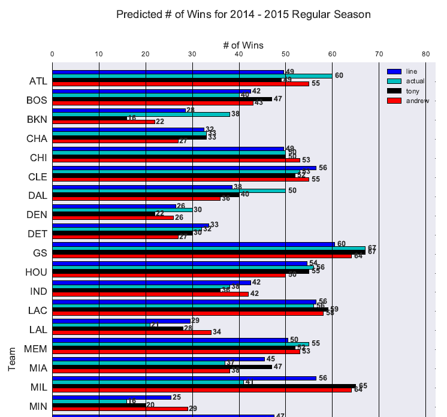
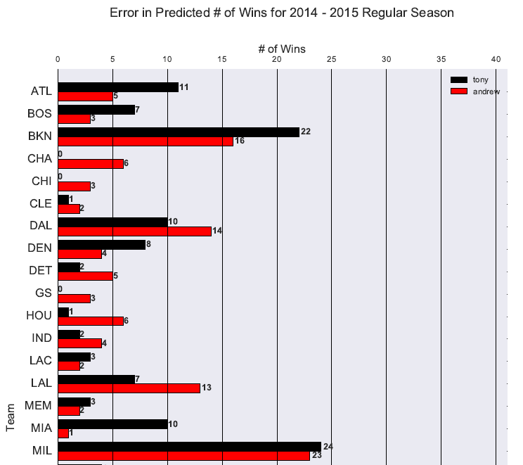

# Introduction

This project is no longer under development. See my more recent `nba` repo
for my current efforts on this subject.

I used this project primarily as a means of learning `python` (at the beginning of 2016,
during my last semester of colleg). The project
itself explored a number of topics, including the following:

+ Re-generation of NBA team win totals picks incorporating team schedules and
personal predictions given for a season. Subsequent analysis evaluated the
accuracy of actual predictions and the "back-cast" simulated predictions.
+ Analysis of daily NBA betting lines.

Manually tracked NBA predictions for team win totals (made by me and my borther)
serve as the primary source of data.
Data scraped from <https://www.espn.go.com> serves as a supplementary data source
for team schedule and Las Vegas Odds information.
Some other data was downloaded directly from the
[Advanced Pro Basketball Reference (APBR)](http://apbr.org/metrics/viewforum.php?f=2)
forums.

Some online tutorials, such as this [data scraping](https://fansided.com/2015/09/07/nylon-calculus-101-data-scraping-with-python/) article and this
[data visualization](https://fansided.com/2015/09/14/nylon-calculus-101-visualizing-the-nba-draft-with-python/) articles, provided a **TON** of guidance on using `python`.
The `beautifulsoup`, `Pandas`, `seaborn`, and `matplotlib` packages are used
extensively in the `python` scripts. Gaussian distributions are used as the basis
forcreating "back-cast" simulations of predictions.

The visualizations created for the analysis of "back-cast" NBA team win total
predictions are in the `output` folder of this repo. Statisical measurements
of error indicate that my brother has been more accurate than me in actual
predictions (and in the back-cast predictions).

# Highlights

## Win Total "Back-Cast" Simulations

## Summed Error of Back-Cast Simulations

